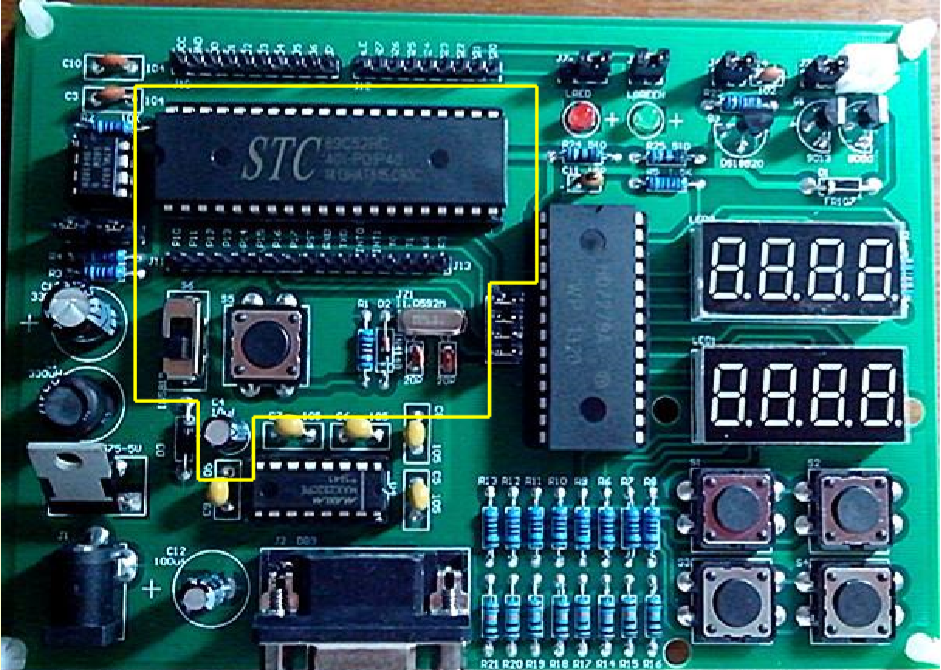
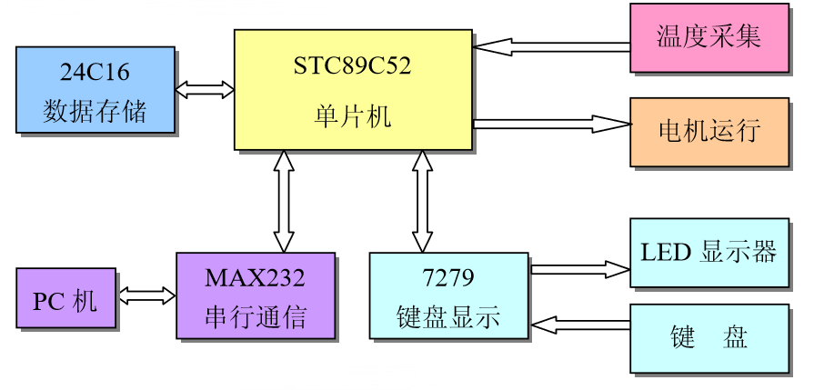
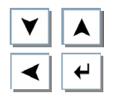
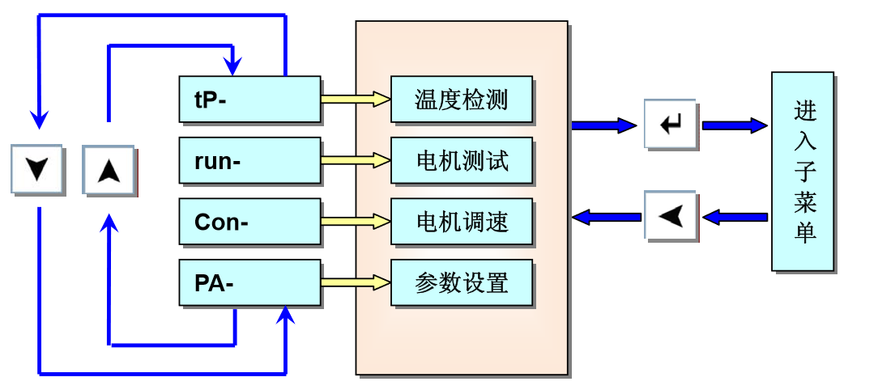
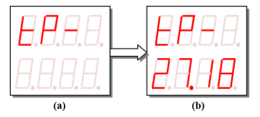
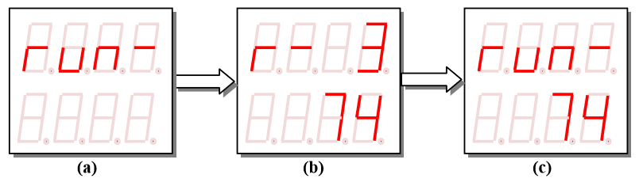
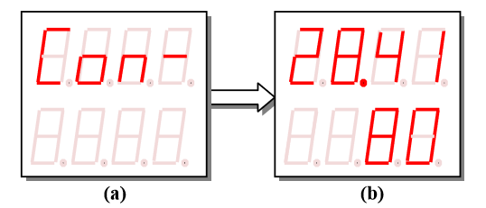
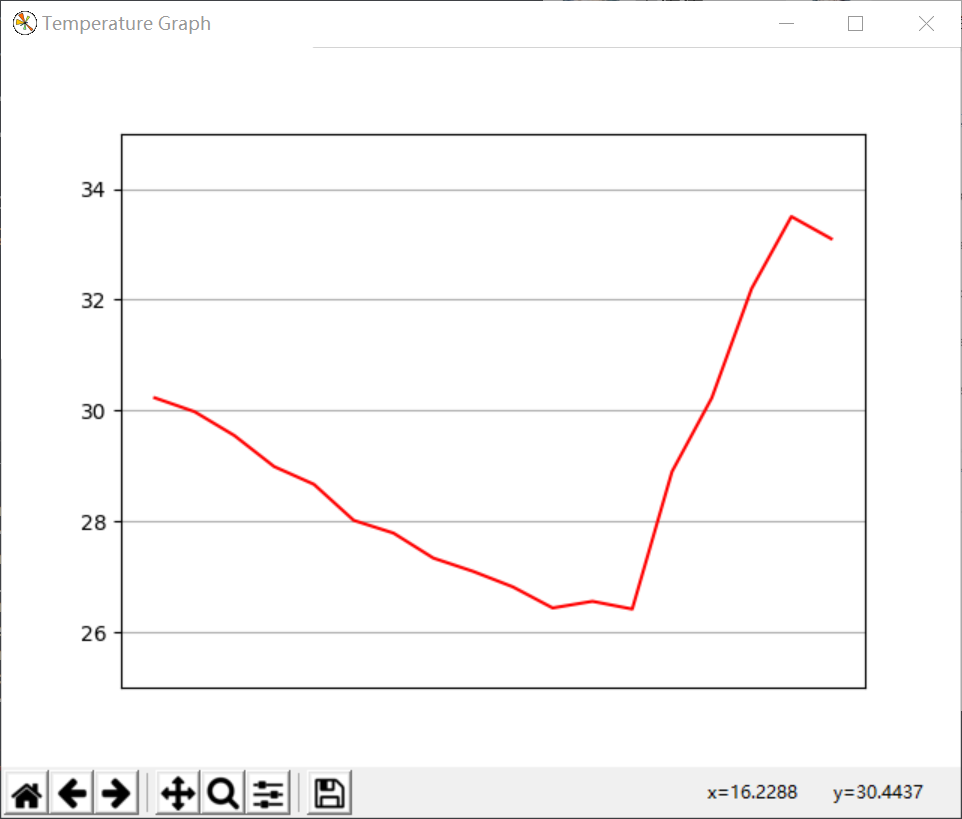

# Intelligent Cooling System

An STC89C52-Microcontroller-based and PID-powered intelligent cooling system.



## Hardware Connections



- STC89C52: 8-bit Microcontroller
  - ROM: 8K bytes flash
  - RAM: 256 bytes, so we need two hex numbers for addressing.
- HD7279A: used to connect to LED and keyboard.
- DS18B20: temperature sensor (温度采集)
- 24C16: A 16K E2PROM (Electrically Erasable Programmable Read-Only Memory)
  - It can store data even without electriciy, which is different from RAM.
- PC: Personal Computer, which is used to load the program, and print the temperature curve on the screen (**bonus!**).
- Other

  - Keyboard (键盘)

    - Each button in the above picture is treated as a key as follows:

        

    - Support fast value change while holding the button pressed.

  - LED
  - Motor (电机运行), which is used to drive a cooling fan.

## Functionalities



- tP-: temperature sensing
- run-: tests for the motor
- Con-: motor speed change according to the temperature sensed
- PId- (**bonus!**): adjust the speed of the cooling fan to keep the surrounding temperature at a user-given value
- PA-: settings for parameters
  - Password Authentication (**bonus!**)
- 进入子菜单：entering the sub menus

### tP-: Temperature Sensing

Pressing ↵ when the LED shows **tP-** on the top row to use this functionality. The top row should still show **tP-** but the bottom row shows the **current temperature with two decimal places**.



### run-: Tests for the Motor

After entering this menu, you can select one of the _r-1_ to _r-10_ test cases (which can be set up in PA- menu) to test your motor. Each test case is represented by a number which indicates **duty cycle**. After navigating using ↑ and ↓, and choose a test case using ↵, a **PWM** (Pulse Width Modulation) wave with this duty cycle will be generated and used to drive the motor.



### Con-: Motor Speed Change according to the Temperature Sensed

Calculate the duty cycle and generate the corresponding PWM wave on the fly using the following equation:


in which:

- Tdown and Tup is the upper and lower threshold of temperature, which can be set up in PA- menu.
- Tnow is the current surrounding temperature.

Top LED shows the current temperature, and the bottom one shows the calculated PWnow:



### PId- (**bonus!**): Adjust the Speed of the Cooling Fan to Keep the Surrounding Temperature at a User-Given Value

Given a temperature (which can be set up in PA- menu), the duty cycle is computed using [**PID controller**](https://en.wikipedia.org/wiki/PID_controller). The _proportional_, _integral_ and _derivative_ terms are set in the source code. The goal is to keep the surrounding temperature at a given value through adjusting the speed of the cooling fan. Top LED shows the current temperature, and the bottom one shows the calculated PWM duty cycle:


### PA-: Settings for Parameters

This is where you can set the parameters used in previous functionalities.

Each time you want to change the parameters of PID, you are required to input a password which is set in the [source code](https://github.com/Yuchen-Wang-SH/Intelligent-Cooling-System/blob/78f7a1aa6347441ee18ea67e04f43d63ba4ffca7/main.c#L74-L75), or you will not be able to get in.

## Plotting the Temperature Curve on Your Computer!

Prerequisites:

1. The system is connected to your PC.
2. Set serial port number to COM3.
3. Python environment is ready.
4. Type in the command line:

```
python plotting.py
```

You should see a temperature curve pop up, and refresh in real time:

  
